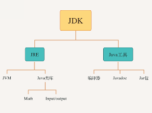

# 第一部分环境搭建

## 一、理论梳理

### 1. 什么是JDK

**JDK(Java Development Kit**，（**Java**开发工具包)**，**里面包含了Java运行环境JRE（Java Runtime Envirnment），一系列Java工具（compiler/java/jdb/javadoc等与Java基础的类库。

通俗来讲，计算机是无法识别Java语言的，只有安装了JDK，计算机才能识别Java语言

我们可以用这个图示来表示JDK,JRE与JVM区别：



**JRE(Java Runtime Environment Java运行环境)** :里面包含了java虚拟机（JVM），以及支持java语音运行的基本与常见的类库，例如lang包下的内容，以及其他基本库例如Input/Output,Date等。

**JVM（Java Virtual Machine，Java虚拟机）**: 执行Java字节码文件的虚拟计算机，也是java跨平台的核心部分。

### 2. 路径与环境变量

**路径**：当前程序运行所处目录的命令表示。

例如： 

```
C:\Users\Administrator>
```

代表当前路径是C盘中Users文件夹中的Administrator文件夹

```
D:\test>
```

代表当前路径是D盘中的test文件夹

常见路径操作的基本命令：

| 命令   | 解释                    |
| ------ | ----------------------- |
| d:     | 进入D盘根目录           |
| cd xxx | 进入当前路径下xxx文件夹 |
| cd /   | 退回至当前硬盘根目录    |
| cd ..  | 退回至当前路径的父目录  |

**path环境变量**：系统要运行一个程序，如果在当前目录下寻找不到该程序，还可以在path中的指定路径下去寻找。 因此如果想在系统任意目录下运行一个程序，可以将该程序的路径添加到path环境变量中。

### 3. 编译与运行

**编译型语言**：在程序运行之前需要有一个编译的过程，将程序编译成机器可识别的机器语言文件，再执行该文件。例如：Java，C，C++等。

**解释型语言**：程序运行的时候才翻译，程序每执行一次，就要翻译一次。例如：JavaScript, python, Ruby, Matlab等。

java是编译型语言，需要首先写好java代码，通过java compiler一次性编译成JVM（java虚拟机）可识别的.class 文件，才能在JVM上运行。

| 执行过程 | 作用文件类型 | 得到结果     | 命令  | 描述                                                         |
| -------- | ------------ | ------------ | ----- | ------------------------------------------------------------ |
| 编译     | .java文件    | .class 文件  | javac | 将java文件，通过java compiler编译成计算机JVM可识别的.class文件。 |
| 运行     | .class文件   | 程序运行结果 | java  | 在JVM上运行.class文件得到结果                                |

