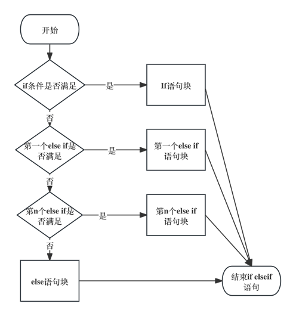
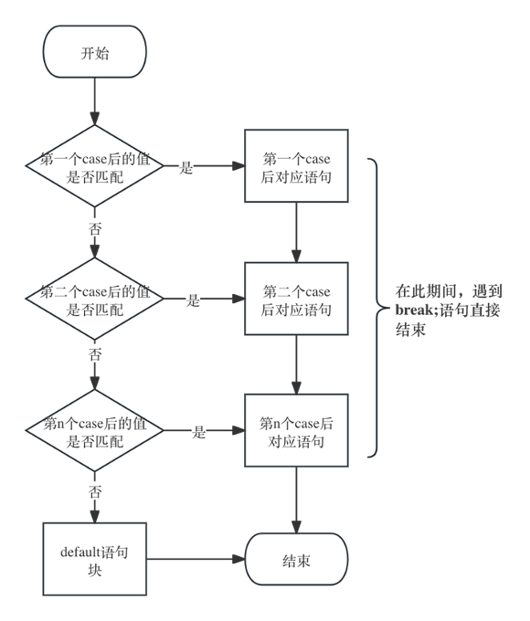

# 第三部分 输入语句及选择语句

## 一、理论梳理

### 1. 输入语句基本用法：

我们这里使用Scanner从控制台读入数据，为了介绍Scanner，首先我们看下面这个例子：

```java
import java.util.Scanner;

public class Sum {
    public static void main(String[] args) {
        System.out.println("Welcome to CS109!");
        Scanner input = new Scanner(System.in);
        int number1, number2, sum;
        System.out.print("Enter the first integer: ");
        number1 = input.nextInt();
        System.out.print("Enter the second integer: ");
        number2 = input.nextInt();
        sum = number1 + number2;
        System.out.printf("Sum is %d\n", sum);
    }
}

```

要点1: ```import java.util.Scanner;```导入```Scanner```这个类

由于Scanner这个类，并没有放在java.lang这个包下，所以我们无法直接使用。 因此，我们需要首先导入Scanner这个类，才能在代码中使用它。导入方式便是在类的第一行写上 import java.util.Scanner;。

要点2: ```Scanner input = new Scanner(System.in);``` 创建```Scanner```的对象

首先在这个阶段，同学们还未学到到类与对象，可以大致解释一下。 这一行语句其实是创建了一个input的对象，我们可以把其理解成一个供我们从控制台读入数据的工具，而通过input的这个工具，可以从控制台读入一个数据，并将其转化成 int，double 等数据类型。  

要点3: ```number1 = input.nextInt();``` 使用input这个工具，执行读入数据

创建好input这个对象后，我们可以把它当作一个可重复利用的工具。执行```input.nextInt();```方法，即从输入流中根据**空格**、**Tab**、**换行符**读入一个String类型的数据，并将其转化成int类型，也就是等号右边的数据。 最后，将等号右边的数据赋值给等号左边的number1，便完成从控制台读入一个整数并赋值给number1的过程。

 ### **2.** 什么是根据空格、Tab、换行符读入：

从控制台读入的数据可以称之输入流，也就是System.in，每创建一个Scanner的对象，即打开一个输入流。那么接下来input.nextInt(), input.next(), input.nextDouble() 等方法，都是从输入流中解析即将读入的数据。那么从哪里解析数据到哪里，主要依据空格、Tab与换行符进行间隔的数据。

我们可以看下面的例子：

```java
public static void main(String[] args) {
    Scanner in = new Scanner(System.in);
    int n1 = in.nextInt();
    double d1 = in.nextDouble();
    String str = in.next();
    System.out.printf("n1=%d\td1=%.2f\nStr=%s", n1, d1,str);
}
```

- **根据空格间隔读入数据：**

  输入：

  ```
  23 15.5 hello world
  ```

  输出：

  ```
  n1=23	d1=15.50
  Str=hello
  ```

  23之后是一个空格，因此 in.nextInt(); 只读取23。同理，最后hello world中间也有空格，那么in.next(); 只读取到hello

- **根据Tab间隔读入数据：**

  输入：

  ```
  23	15.5	hello	world
  ```

  输出：

  ```
  n1=23	d1=15.50
  Str=hello
  ```

- **根据换行键间隔读入数据：**

  输入：

  ```
  23
  15.5
  hello
  ```

  输出：

  ```
  n1=23	d1=15.50
  Str=hello
  ```

### 3.  if - else if - else 语句执行流程

首先判断if后面的条件，如果if后面的条件不满足，则判断紧随其后的第一个else if后面的条件，如果所有else if后面的条件都不满足，则执行else语句块里的内容。



### 4. switch 语句执行流程：

switch语句永远是根据switch后面扣号里的值匹配。首先在switch语句块定位到与括号里的值相等的第一个case后面的值的位置，接下来执行该位置后面的每一条语句，知道遇到break才可以跳出switch语句块。

