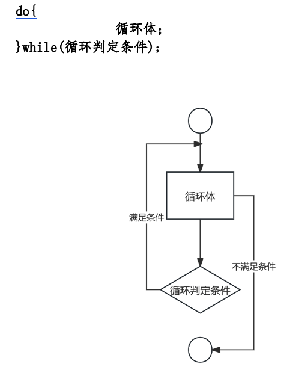

# 第四部分 循环语句

## 一、理论梳理

### 1. while循环

while循环的重点在于，满足while关键字右侧括号内的条件，即可保持循环，否则会跳出循环。

while 循环主要可用于未知循环次数时，以条件来判断循环是否继续下去的场景。while 循环结构如下：


示例代码:

```java
int n = 1;
 while (n <= 5) {
   System.out.println("n=" + n);
   n++;
 }
 System.out.println("END");
```

输出结果：

```
n=1
n=2
n=3
n=4
n=5
END
```

要点1: int n = 1; 循环初始条件。

要点2: (n<=5) 循环判定条件。

要点3: n++; 循环变量

### 2. for循环

for 循环是将循环初始条件、循环判定条件、循环变量全部写在for关键字后面的括号内。大致格为：


示例代码：

```java
for(int n=1; n<=5; n++){
    System.out.println("n="+n);
}
System.out.println("END");
```

输出结果：

```
n=1
n=2
n=3
n=4
n=5
END
```

要点1: 在for循环结构中，可以省略循环初始条件、循环判断条件以及循环变量中的任意一个，但是两个分号不能省略。比如以下结构都是可成立的：


### 3. do while 循环

do while 循环先无条件执行一遍循环体，再判断是否满足条件。其结构如下：



示例代码：

```java
int n = 1;
do{
    System.out.println("n="+n);
    n++;
}while(n<=5);
System.out.println("END");
```

输出结果：

```
n=1
n=2
n=3
n=4
n=5
END
```

### 4. break与continue

break；是跳出当前循环。

continue; 是结束当前轮循环，进入下一轮循环。

在设计循环结构的时候，也可以用下面这种格式，即循环判定条件恒为true，通过特定条件使用break语句来判定何时结束循环。


