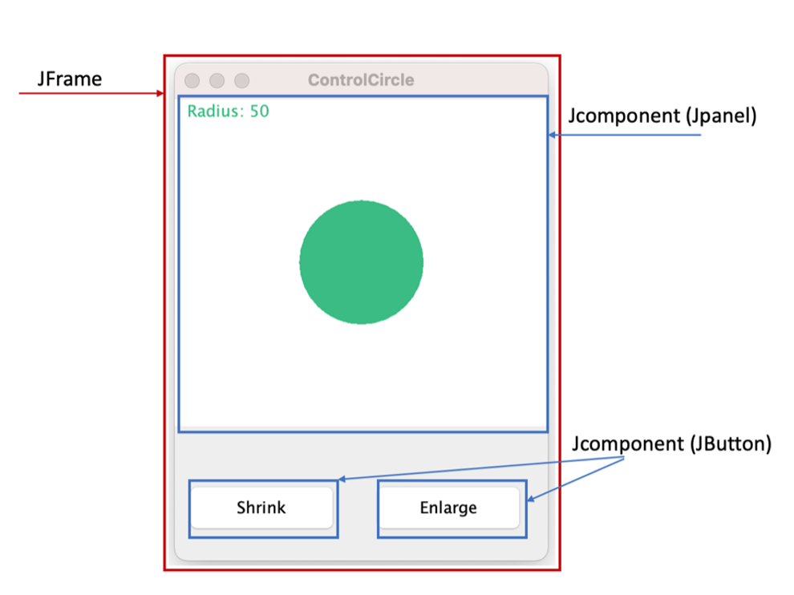

# 第十六部分 Swing基础

## 一、理论梳理

### 1. 窗体与组件

#### (1) 窗体

窗体在Swing中是JFrame类，表示桌面应用程序的外围框架。窗体有一些基本设定例如：

| 方法名                                  | 介绍                                                         |
| --------------------------------------- | ------------------------------------------------------------ |
| setSize(int width, int height)          | 设置窗体的大小，根据传递的参数宽与高来设定                   |
| setTitle(String title)                  | 设置窗体的主题，主题会显示在窗体上                           |
| setLocationRelativeTo(Component c)      | 设置窗体在桌面的位置，如果参数null表示居中                   |
| setVisible(boolean b)                   | 设置窗体是否可见，默认为不可见                               |
| setLayout(LayoutManager manager)        | 设置窗体内部组件的布局，如果参数null表示采用绝对位置布局     |
| setDefaultCloseOperation(int operation) | 设置关闭窗体后的操作，如果参数是JFrame.EXIT_ON_CLOSE，则关闭窗体后结束程序 |

样例代码：

```java
import javax.swing.*;

public class MyFrame extends JFrame {
    public MyFrame()  {
        this.setSize(200,200);
        this.setTitle("Part 16: Swing");
        this.setLocationRelativeTo(null);
        this.setVisible(true);
        this.setLayout(null);
        this.setDefaultCloseOperation(JFrame.EXIT_ON_CLOSE);
    }

    public static void main(String[] args) {
        MyFrame frame = new MyFrame();
    }
}
```

显示结果：


#### (2) 组件

组件是窗体上的元素，例如输入框、显示框、标签、按钮、单选复选框、菜单栏等。在swing的结构中，所有的组件都继承 **JComponent**这个类。 如果我们自定义组件，也是自定义一个类，去继承JComponent这个类。

窗体与组件的关系如图：



### 2. x与y坐标

#### (1) x, y坐标

在Swing设计中，坐标**原点**位于组件或窗体的**左上角**，x坐标代表水平方向的位置，y坐标代表竖直方向的位置。举例说明：如果一个组件的width与height分别是100，50，那么该组件四个顶点的x,y的坐标分别如下：


#### (2) location

在Swing设计中，每一个组件都有一个setLocation(int x, int y)方法，这个设置位置代表着当前组件的左上角（原点）距离它的父组件左上角（原点）的位置。Location常常带有两个参数，分别是x与y，x代表水平方向距离父组件原点的位置，y代表竖直方向距离父组件原点的位置。

例如下面的例子：小正方形代表子组件，长举行代表父组件，那么子组件在父组件的位置是（25，25）


**要点1:** 如果我们想让子组件在父组件相对的位置中显示出来，下面几个要素必不可少：

1)   分别设置两个组件的Size

2)   设置子组件的Location

3)   将子组件添加到父组件上

如下面代码所示：

```java
superComponent.setSize(50,100);
subComponet.setSize(25,25);
subComponet.setLocation(25,25);
superComponent.add(subComponent);
```

### 3. 组件绘制机制 (paintComponent)

组件的绘制机制是显示出组件的主要方法，在组件JComponent类中用于绘制组件的方法如下：

```java
@Override
 protected void paintComponent(Graphics g) {
   super.paintComponent(g);
 }
```

我们自定义组件时，想要按照我们期望的样式绘制组件，就一定要重写paintComponent(Graphics g)方法。

例如这样设计组件：

```java
import javax.swing.*;
 import java.awt.*;
 
 public class MyComponent extends JComponent {
   public MyComponent(){
     this.setSize(100,100);
     this.setLayout(null);
   }
 
   @Override
   protected void paintComponent(Graphics g) {
     super.paintComponent(g);
     g.setColor(Color.WHITE);
     g.fillRect(0,0,this.getWidth(),this.getHeight());
     g.setColor(Color.RED);
     g.fillOval(2,2,this.getWidth()-2,this.getHeight()-2);
   }
 }
```

同时在窗体中，我们这样添加组件：

```java
import javax.swing.*;
 
 public class MyFrame extends JFrame {
   private MyComponent component;
   public MyFrame() {
     this.setSize(200,200);
     this.setTitle("Part 16: Swing");
     this.setLocationRelativeTo(null);
     this.setVisible(true);
     this.setLayout(null);
     this.setDefaultCloseOperation(JFrame.EXIT_ON_CLOSE);
 
     this.component = new MyComponent();
     this.component.setLocation(50,50);
     this.add(component);//add component to frame
   }
 
   public static void main(String[] args) {
     MyFrame frame = new MyFrame();
   }
 }
```

如下所示，底色白色矩形红色圆球的图案，就是写在paintComponent方法中的内容。


**要点1**: paintComponent方法无法通过用户自行调用，需要通过**repaint()**方法来调用。一般在构造方法中，会默认绘制一次，如若后期想改变绘制的样式，需要执行repaint()语句才能重新绘制。

### 4. 事件与监听-硬编码

在Swing中常用的事件，可以包含鼠标点击事件、键盘点击事件等。可以通过两种方式使用：

**硬编码常用于设置固定功能的组件,多次创建该组件时，不用一一重写该监听事件。**

使用方法：将下面代码添加到组件的构造方法里

```java
this.enableEvents(AWTEvent.MOUSE_EVENT_MASK);//mouse event
this.enableEvents(AWTEvent.KEY_EVENT_MASK);//key event
```

在自定义组件的类中，添加这两个方法。其中，只要发生鼠标点击事件，程序会立刻执行processMouseEvent()方法，只要发生键盘点击事件，程序会立刻执行processKeyEvent() 方法。

```java
@Override
protected void processMouseEvent(MouseEvent e) {
    super.processMouseEvent(e);
    if(e.getID() == MouseEvent.MOUSE_PRESSED){
        //todo: design statements here
    }
}

@Override
protected void processKeyEvent(KeyEvent e) {
    super.processKeyEvent(e);
    if(e.getID()==KeyEvent.KEY_PRESSED){
        //todo: design statements here
    }
}
```

**要点1**: 对于这两个事件，我们只给出Pressed方式，例如鼠标点击事件，还有Mouse_Clicked, Mouse_Moved等等。

**要点2**: 对于KeyEvent我们需要设定当前组件是**可聚焦**的才能使用，否则swing窗体下有多个组件，并不能确定点击键盘时，哪一个组件需要响应。例如添加这句：

```this.component.setFocusable(true);```

### 5. 监听器 Listener

**常用于同一个组件的不同对象可以响应不同功能**，例如点击不同JButton发生的动作不同。

使用方式：在外层获取组件具体某一个对象，通过addListener的方式添加触发事件后，实现的具体功能。

#### (1) 添加 MouseListener

我们以自定义组件的对象，添加一个MouseListener为例：

```java
this.component.addMouseListener(new MouseAdapter() {
   @Override
   public void mouseClicked(MouseEvent e) {
     super.mouseClicked(e);
     //todo: design statement here
   }
 });
```

我们指定在this.component对象上，添加一个监听器MouseListener，即当鼠标点击这个组件后，会执行mouseClicked(MouseEvent e)方法体中的所有语句。

**要点1: MouseAdapter适配器。** addMouseListender()括号内是传递一个MouseListener的参数，然而MouseListener本身是一个接口，其包含5个抽象方法：

1)   mouseClicked(MouseEvent e)

2)   mousePressed(MouseEvent e)

3)   mouseReleased(MouseEvent e)

4)   mouseEntered(MouseEvent e)

5)   mouseExited(MouseEvent e)

如果创建一个MouseListener的匿名内部类，那么便要实现全部的抽象方法。而这里是通过一个适配器模式，用MouseAdapter来完成化简代码。MouseAdapter中实现了上述5个抽象方法，只是方法体中没有任何语句。我们用这种模式的便捷之处，即是在匿名内部类的创建时，**可支持仅重写其中一个抽象方法**，从而达到简化的代码的目的。

#### (2) 添加KeyListener

与MouseListender类似，我们以自定义组件的对象，添加一个KeyListener为例

```java
this.component.addKeyListener(new KeyAdapter() {
   @Override
   public void keyPressed(KeyEvent e) {
     super.keyPressed(e);
     //todo: design statement here
   }
 });
```

我们指定在this.component对象上，添加一个监听器KeyListener，即当鼠标点击这个组件后，会执行keyPressed(KeyEvent e)方法体的所有语句。该适配器模式与MouseListender类似，同时也想说明KeyListener中也有3个抽象方法：

1)   keyTyped(KeyEvent e)

2)   keyPressed(KeyEvent e)

3)   keyReleased(KeyEvent e)

 #### (3)  添加 ActionListener

ActionListender常常添加在JButton的实例中，完整写法如下：

```java
button.addActionListener(new ActionListener() {
   @Override
   public void actionPerformed(ActionEvent e) {
     //todo:design statements here
   }
 });
```

我们指定在button对象上，添加一个监听器ActionListener，即当鼠标点击这个组件后，会执行actionPerformed(ActionEvent e)方法体的所有语句。

**要点1:** **这里无需Adapter**。因为 addActionListender()括号中传递的参数时ActionListener, 其本身只有一个抽象方法，即actionPerformed(ActionEvent e)， 因此，我们仅需创建ActionListener本身的匿名内部类就可以了。

**要点2: Lambda表达式化简**。当匿名内部类中，仅包含一个抽象方法时，我们可以使用Lambda表达式化简。参数->{方法体}

```java
button.addActionListener(e -> {
   //todo:design statements here
 });
```


